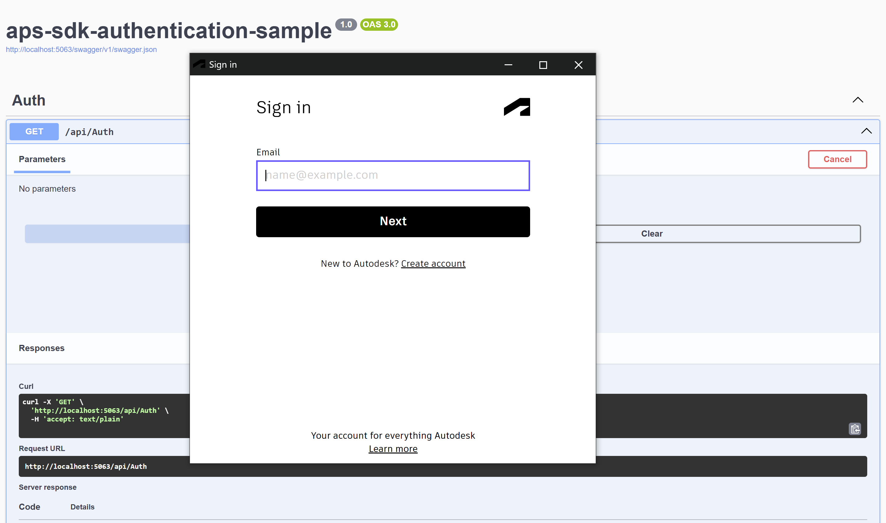
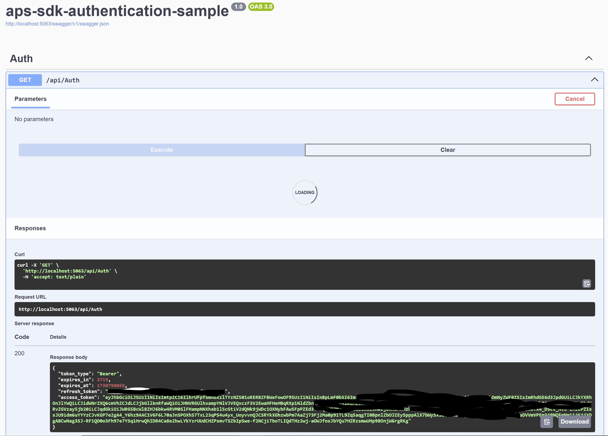

# Autodesk APS 3-Legged OAuth Sample using SDK


[](https://visualstudio.microsoft.com/vs/community/)

[](https://aps.autodesk.com/en/docs/oauth/v2/developers_guide/overview/)


[](http://opensource.org/licenses/MIT)


# Description

This sample demonstrates the retreival of Autodesk APS 3-legged authentication token using C# .NET SDK: [Authentication (OAuth)](https://aps.autodesk.com/en/docs/oauth/v2/reference/dot-net-sdk/Autodesk.Authentication/AuthenticationClient/)


# Thumbnail






# Demonstration

- Start the project
- On the `Auth` controller, expand the `GET /api/Auth` endpoint and click execute
- The `Sign in` dialog pops up for you to input your email and password
- Once authenticated successifully, you will get a message to close the popup


# Setup

## Prerequisites

- [APS credentials](https://forge.autodesk.com/en/docs/oauth/v2/tutorials/create-app)
- [Visual Studio Community 2022](https://visualstudio.microsoft.com/vs/community/) or [.NET 8](https://dotnet.microsoft.com/en-us/download/dotnet/8.0)
- Terminal (for example, [Windows Command Prompt](https://en.wikipedia.org/wiki/Cmd.exe) 
or [macOS Terminal](https://support.apple.com/guide/terminal/welcome/mac)) if you don't have Visual Studio
- [Autodesk.Authentication Package](https://www.nuget.org/packages/Autodesk.Authentication)

## Running locally

If you have Visual Studio Community 2022 installed

- Clone this repository
- Build and run the project

If you do not have it installed

- Clone this repository
- Install dependencies: `dotnet restore`
- Setup environment variables in the appsettings.json File:
  - `ClientId` - your APS application client ID
  - `ClientSecret` - your APS application client secret
  - `Callback` - your callback url adden on your aps application
- Run the project: `dotnet run`

Currently the addin uses `http://localhost:3000/api/aps/callback/oauth` as the callback. This callback should also be added at your application Callback URL in the General Settings section of your [APS Application](https://aps.autodesk.com/myapps/). The port can be changed to whatever port you wish by adding an environment variable "PORT".

# Further Reading

## Tips & Tricks

- Before running the project, we need be able to communicate with 3 legged token callback over HTTP and HTTPS. At a minimum, you want to configure a URL registration and add a Firewall exception for the URL your service will be using. You can configure these settings with the Netsh.exe tool as follows:
```powershell
netsh http add urlacl url=http://+:3000/api/aps/callback/oauth/ user=DOMAIN\user
```
- Please refer to [Configuring HTTP and HTTPS](https://docs.microsoft.com/en-us/dotnet/framework/wcf/feature-details/configuring-http-and-https?redirectedfrom=MSDN) for details.

## Troubleshooting

- Access denied: If you get access denied error when running the addin authentication, please run Visual Studio in Administrator mode to get 3 legged authentication working


## Documentation

For more information, see the documentation:

- [Authentication API](https://aps.autodesk.com/en/docs/oauth/v2/reference/http/authorize-GET/)
- [Authentication SDK](https://www.nuget.org/packages/Autodesk.Authentication/2.0.0-beta4#package-manager)

# License

This sample is licensed under the terms of the [MIT License](http://opensource.org/licenses/MIT). Please see the [LICENSE](LICENSE) file for full details.

# Written by

[Moturi Magati George](https://www.linkedin.com/in/moturigeorge/)
